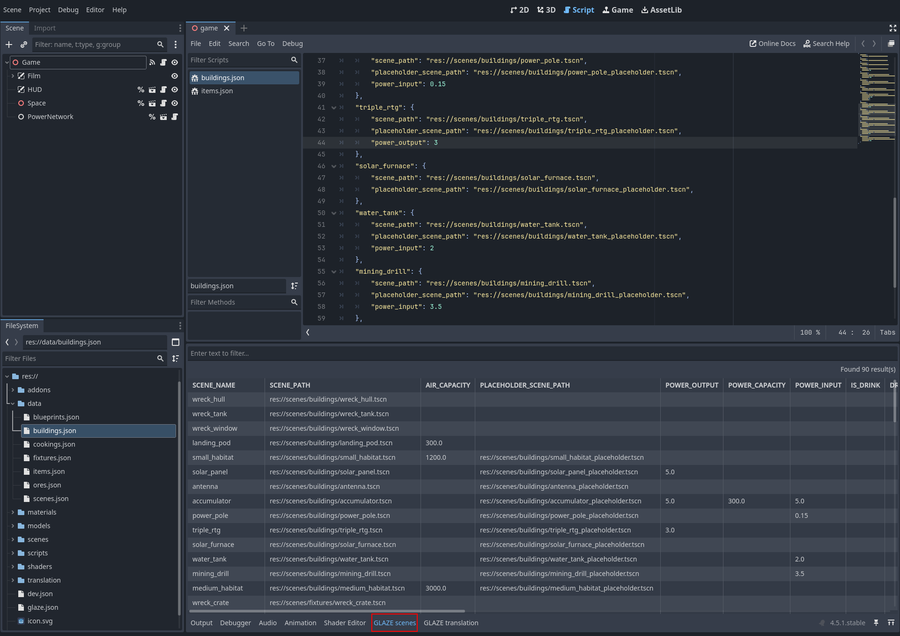
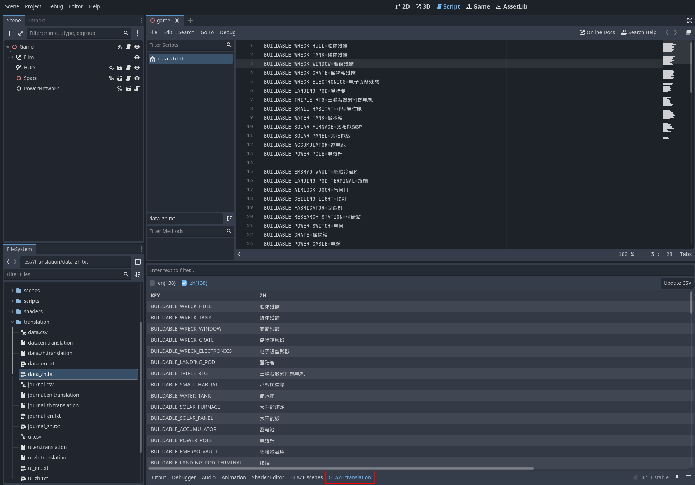
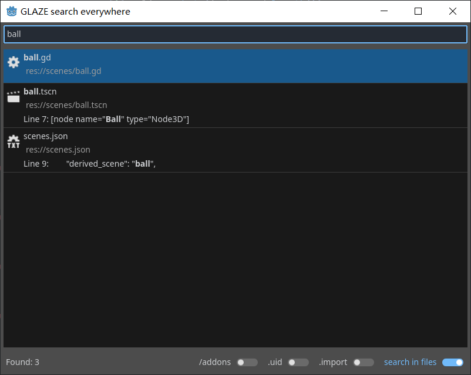

# Project Glaze
[](README.md)
[](README.zh.md)

Godot Library by AZurEsu. It works as a plugin.

## Scripts

### Glaze
An auto-loaded global singleton added by plugin. It provides many useful functions.

Some important functions as following:

| Function | Description |
| --- | --- |
| new_scene | Creates a new scene instance from cached packed scene. |
| rand_option | Returns an option randomly picked from an array. Chance of picking depends on the weights if specified. |
| load_json_as_array | Load JSON file and make sure it is an array. Built-in types can be parsed optionally. |
| load_json_as_dict | Load JSON file and make sure it is a dictionary. Built-in types can be parsed optionally. |

#### More about Glaze.new_scene()
This function provides useful features for you to create new instance of scenes. At minimum, you got:
	
- Cache: Glaze automatically caches all packed scenes so you don't have to store them manually;

- Simplicity: You can create new scene instance and add it into parent with single-line script.

For example, the following three lines:

```
var packed_scene = load("res://scenes/object.tscn")
var new_object = packed_scene.instantiate()
parent_node.add_child(new_object)
```

Can be reduced to one line:

```
Glaze.new_scene("res://scenes/object.tscn", parent_node)
```

At maximum, you get following advantages if you define scenes in scene data file:

- Scene can be referred with short name which is immune to directory change (you have to change scene_path in the data file of course but no change required in script);

- Data can be centralized into data files so you can use your preferred text editor to make the change;

- Data can be inherited from another to reduce duplication therefore mistakes of inconsistent data;

- Plugin has Scene Data Viewer enabled in Godot IDE bottom panel which is a great way to view and search data.

### Version
A simple class represents version in: major.minor.patch.build.

### Parser
A class provides parsing and formating on various types when working with JSON. User can customize parsers and add them into Glaze.

### CustomImport
A customizable post-import script utilizes regular expression to locate nodes and process.

A simple example to use this script to hide all nodes which have name ends with *_invis*:

```
@tool
extends CustomImport

func _customize() -> void:
	add_callback("_invis\\z", _set_invis) # Returns false if regex failed to compile.

func _set_invis() -> void:
	if node is Node3D:
		node.visible = false
```

### Build
A build script can be run directly in headless mode.

You can call it as following way in your shell script:

```
%GODOT% --headless -s addons\glaze\build.gd -- <command> [arguments]
```

Command list:

```update_build_number -version_file <path> [-update_project_file]```

Increases version build number by 1 in the version file. You can also update project file with the new version (optional).

## Custom nodes

### Evaluate
A bidirectional binding which updates property automatically with configured source. After being added into parent, name it with the property name you want to set.

For example, we have a scene:

```
UI (source: ui.gds)
  - Label
    - text (source var: label_text)
    - visible (source var: label_visible)
```

In ui.gds, we define two members to provide binding data:

```
var label_text: String:
	get: return "something"
var label_visible: bool:
	get: return true
```

As a result, the label text and visibility is controlled by binding data in runtime.

When you need to set value back to the source variable, enable bidirectional flag. Easy!

If source is not specified, scene owner will be used in default.

### Interval
A timer calls a func on the parent node periodically. After being added into parent, name it with the func name you want to call.

Comparing with Godot bulti-in timer, it has advantages:
	
- Stable interval when it is small;

- Easy to config: name it with called func;

- Flexiable interval config with ratio in runtime;

- Random start-up to reduce clog when large amount of Intervals added into scene tree (for example when game is loaded).

### StateMachine and State
A simple implementation of state machine. Just another lovely wheel :)

## Tools in Godot editor
Some tools are added into Godot editor once plugin is enabled.

### Scene data viewer
A new tab called 'GLAZE scenes' will be available on bottom area. It lists all scene data.



### Translation viewer
A new tab called 'GLAZE translation' will be available on bottom area. It lists all translations. You can also update all translation CSV files in one click here.



### Search everywhere
Press SHIFT twice, a window titled 'Search everywhere' will pop up and allow user search all files under project folder by name.



## Setup
There are two ways to enable the plugin: copy addons or use symlink.

### Copy addons
Copy directory 'addons' to your project.

### Use symlink
Run following command with administrator privilege:

`mklink /D <project_dir>\addons\glaze <glaze_dir>\addons\glaze`

*Note if you clone the plugin repository and use symlink in your project, changes will be made to some plugin scenes as they are marked @tool.
Therefore you will have uncommited changes in Git repository.*

### Add configuration file (optional but highly recommended)
Once plugin is installed and enabled, you may create a JSON file under your project directory and named it 'glaze.json'.
This is the configuration this plugin reads whenever game starts. So you need to export this file as well.

| Property | Description | Default value |
| --- | --- | --- |
| log_level | Log level | "INFO" |
| log_rich_text | Log message in rich text (different colors for different levels) | true |
| scene_data_allow_builtin_types | Allow built-in types configured in scene data file | true |
| scene_data_files | A list of scene data files | [] |
| translation_languages | A list of translation languages, like en, zh, etc. | [] |
| translation_files | A list of translation CSV files | [] |

## Scene data
You can configure any property accessible to the scene. However there are some pre-defined properties will be used by plugin:
| Property | Description |
| --- | --- |
| scene_path | A full path to the tscn file |
| derived_scene | A scene from which all properties will be inherited to this scene |
| scene_name | Note you don't need to config this in data file, instead the scene name will be set to this property if it exists in scene script. The name will also be set to meta so you may retrieve it even the property does not exist. |
